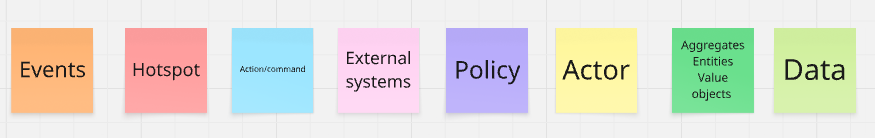
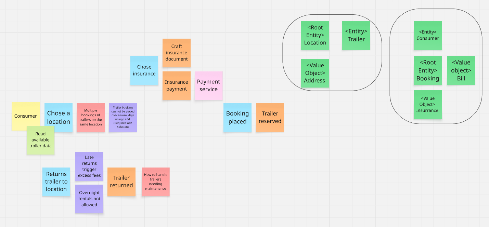
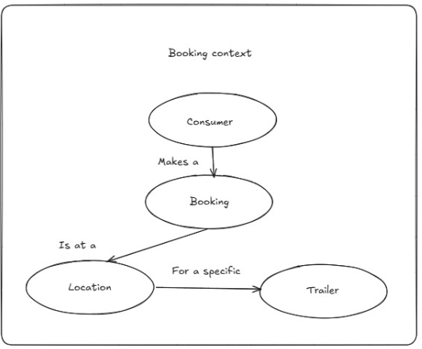
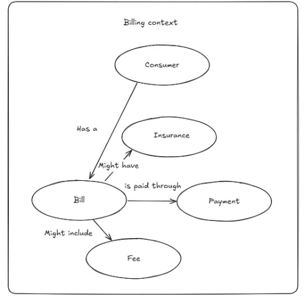
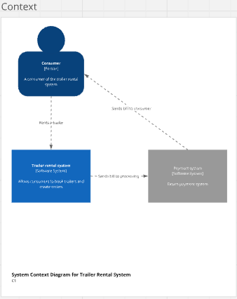
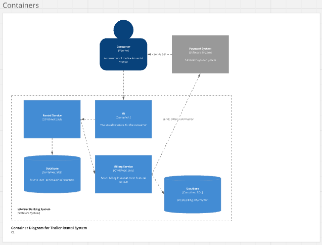
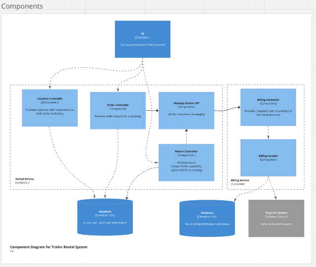

# MyTrailer systems integration - OLA 3 & 4

### Made by

- Pelle Hald Vedsmand - cph-pv73@stud.ek.dk
- Lasse Hansen - cph-lh479@stud.ek.dk
- Nicolai Rosendahl - cph-nr135@stud.ek.dk

## Objective of assignment (OLA 3):

We are being tasked with modeling the messaging flow between services and suggest an overall architecture for the MyTrailer system, using the DDD approach.

## Definition of Done for the modeling process:
- A clear understanding of the business domain and its requirements through event storming.
- Identification of the core domain and bounded contexts.
- Domain model diagrams per bounded context, alongside glossaries defining the ubiquitous language.
- C4 diagrams illustrating the system's architecture at various levels.

## Event storming
Our event storming board can be found [here](https://miro.com/app/board/uXjVJFl0CZ0=/).

We started out by doing an event storming session to get a better understanding of the business domain and its requirements. We identified the core domain, subdomains, and bounded contexts. We also identified the main events, commands, and aggregates in the system.

The following post-its were used in the event storming session:



- Orange: Being the events happening in the system.
- Blue: Being the commands that trigger the events.
- Red: Indicating hot spots that might represent uncertainties or potential issues needing attention.
- Pink: Representing external systems or actors that interact with the system.
- Purple: Being company policies or rules that govern the system's behavior.
- Yellow: Being actors, usually users making an action.
- Dark green: Representing the aggregates, entities and value objects in the system.
- Light green: Representing the need for reading data.



We tried to put the post-its in a logical order, representing the timeline or flow of the events taking place in the system. We also identified 2 aggregates consisting of multiple entities and value objects. These aggregates later became the basis for our bounded contexts.

## Bounded contexts
Based on the event storming session, we settled on the following 2 bounded contexts:
1. Rental context - handles everything to do with rental of trailers, including availability, booking and status updates.
2. Billing context - handles everything to do with billing and payments, including invoicing and payment processing.

We created glossaries for each bounded context, defining the ubiquitous language used within each context.

[Glossary](documentation/bounded_contexts/MyTrailer%20glossaries.docx)

Domain diagrams was also created for each bounded context, fleshing out the aggregates, entities, value objects and their relations within each context.

#### Rental Context



#### Billing Context



## C4 diagrams

We created C4 diagrams to illustrate the system's architecture at various levels, and used it as a tool to discuss and refine our architecture.

#### Level 1 - System Context Diagram



The only external service we have identified is a payment gateway, which is used to process payments. This service is only interacted with from the Billing context. Although, it was discussed that since MyTrailer also has a web solution that system could be used for login and user management, but it was decided that this was out of scope for the current assignment.

#### Level 2 - Container Diagram



C2 shows the two bounded contexts as separate containers, each with their own database. The rental context is responsible for most of the users immediate needs, and is therefore the main entry point for the system. The billing context is only interacted with when a rental is created/completed and an invoice needs to be generated.

#### Level 3 - Component Diagram



The component diagram deep dives into the content of each container and shows the main components and their interactions. 

Within the rental context, we have the following components:
- Location controller - provides functionality for searching and filtering trailers based on location and availability.
- Order controller - handles the creation and management of rental orders.
- Return controller - manages the return process of rented trailers.
- A message broker - used for communication between the rental and billing contexts. In our case, we have chosen to use RabbitMQ as the message broker using a publish-subscribe pattern, as the billing context will be subscribed to events happening in the rental context.

Within the billing context, we have the following components:
- Billing controller - handles the creation and management of invoices.
- A billing facade - used to loosen the coupling between the billing controller and the payment service.

## Conclusion of modeling process

Through the event storming session, we were able to gain a better understanding of the business domain and its requirements. We identified the core domain and bounded contexts, and created domain model diagrams and glossaries for each context. We also created C4 diagrams to illustrate the system's architecture at various levels. This approach gave us a top down exploration of the system and its requirements, providing us a better foundation for making the right architectural decisions. 

Most of the decisions made during the modeling process were strategic decisions, as we were working on a high level. However, some tactical decisions were also made, such as the choice of using RabbitMQ as the message broker and the publish-subscribe pattern for communication between the rental and billing contexts.

## Objective of assignment (OLA 4): 

Using the bounded contexts designed in OLA 3, we are to implement the system described in the modeling process. We are to prepare documentation showing how we built the system, including patterns used. The implementation needs to have a working prototype.

## Implementation

Implementation is based on the architecture designed in OLA 3, with 2 bounded contexts acting as separate services. The rental service is the main entry point for the system, exposing a REST API for users to interact with.

The full implementation can be found on the [GitHub repository](https://github.com/MrJustMeDahl/si_ola3-4)

### Technologies used
- Java 21
- Javalin 6.7.0
- Maven
- RabbitMQ 4.1.4
- Docker

### To run the system
1. Clone the repository
2. Make sure you have Docker installed and running
3. Open a terminal and navigate to the root of the project
4. Run the following command to start RabbitMQ:
   ```
   docker compose up -d
   ```
5. Execute the 2 main classes to start the services:
   - MyTrailer/src/main/java/org/soft2/server/Main.java
   - MyTrailerBilling/src/main/java/org/soft2/Main.java

6. Now the API is ready to receive requests, and send messages between the services when required.

### API Endpoints
Base URL for Rental service: `http://localhost:7000/api`

| Method | Endpoint                | Description                                           |
|--------|-------------------------|-------------------------------------------------------|
| GET    | /locations              | Get all locations                                     |
| GET    | /locations/{locationId} | Get all available trailers on location                |
| POST   | /createorder            | Creates booking for a specific trailer at a specific time |
| POST   | /returnTrailer          | Notify that a trailer has been returned, and an order therefore can be closed |

### Communication between rental and billing service
The communication between the rental and billing service is done using RabbitMQ as the message broker. We chose to use the publish-subscribe pattern, having the rental service being the producer, publishing messages to the billing service that is then consuming the messages by being subscribed to certain queues. 

We ended up using the topic exchange type, as it gives us the most flexibility in terms of routing messages to specific queues, even though it is probably slightly overkill for the current use case. The reasoning for choosing this approach was mainly bound on the fact that we wanted to be able to easily create new binds between the exchange and queues, if we were to add more functionality to the system in the future.

In our current state 2 types of events are being published from the rental service:
1. rental.order.create - published when a new order is created, containing information about the order. This event creates a new invoice in the billing service and handles payment in case insurance was added. [source code can be found here](MyTrailer/src/main/java/org/soft2/handlers/OrderHandler.java)
2. rental.return.trailer - published when a trailer is returned, containing information about the order. This event updates the invoice in the billing service to mark it as completed, as well as handles payment for any excess fees. [source code can be found here](MyTrailer/src/main/java/org/soft2/handlers/ReturnHandler.java)

The messages are then being consumed by the billing service, which then handles the events accordingly based on the routing keys. [source code can be found here](MyTrailerBilling/src/main/java/org/soft2/messaging/Consumer.java)

### Patterns used
- Publish-Subscribe pattern - for messaging between the rental and billing services.
- Facade pattern - is a future implementation to decouple the billing context from the external payment service.
- DAO pattern - for data access and manipulation in both services.
- DTO pattern - for data transfer between layers in both services.
- Singleton pattern - for database connection (only implemented for the order DAO so far).
- MVC pattern - for the rental context. Separating the concerns of the application into models, views and controllers. Keep in mind that for the prototype here the view has not been implemented.
- Ports and Adapters pattern - for the billing context. Separating the core domain logic from the infrastructure and external services.

### End-2-End flow

The flow would be defined as follows:
1. The locations are retrieved.
2. The user selects a location and retrieves all available trailers on that location.
3. The user selects a trailer and creates an order for a specific time period, optionally adding insurance.
4. The rental service publishes a message to the billing service containing order details.
5. Billing service handles invoice creation and payment if insurance was added.
6. The user returns the trailer.
7. The rental service publishes a message to the billing service containing order details.
8. Billing service adds any excess fees to the invoice and handles payment if needed.

#### Step 1 - Get locations

Request:

```
GET http://localhost:7000/api/locations
```

Result:


### Conclusion of implementation process
We successfully implemented a prototype of the system designed in OLA 3 using the bounded contexts and architecture described. The rental service is the main entry point for the system, exposing a REST API for users to interact with. The billing service is responsible for handling invoices and payments, and is only interacted with when a rental is created or completed.
The communication between the rental and billing services is done using RabbitMQ as the message broker, using the publish-subscribe pattern. This approach allows for loose coupling between the services, making it easier to maintain and scale the system in the future.

